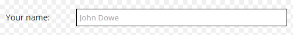

# The form helper ``form:: ... `` #
The form helper is dedicated to simplify various code output functions.

### What is this class for? ###
Instead usage of the usual `<?="<a href=\"linkUrl\">Link</a>"?>` with the current class you can call `form::link("linkUrl","Link");`

### Files structure? ###
* [form.php](/form.php) is the main helper class, dedicated to serve mainly the input calls `form::inpField("Email","user-email","",array("type"=>"email"));`
* [formCore.php](/formCore.php) is the core helper class, dedicated to serve mainly the html output calls `form::html("Show my message here!");`
* [add/](add) folder contain a [form.css](add/form.css) - a base stylesheet file to help with simple inputs formating. 

##Methods##
Observing all possible calls is a hige task, so only general examples will be shown below. 

### Input calls ###
The form input calls are served from the outer [form.php](form.php) class methods. 

#####Input field
`form::inpField($label="", $name="", $value="", $args=array());`

---
<pre style="width:49%; float:left; box-sizing:border-box; margin:0px 10px 0px 0px;">
form::inpField(
    "Your name:",
    "visitor-name",
    "",
    array("placeholder"=>"John Dowe","autofocus"=>true,
	  "fld-class"=>"width-50pc flex")
);
</pre><pre style="width:49%; box-sizing:border-box; margin:0px;">
&lt;p class=&quot;fld width-50pc flex&quot;&gt;
    &lt;label&gt;Your name:&lt;/label&gt;
    &lt;input placeholder=&quot;John Dowe&quot; autofocus=&quot;&quot; 
           type=&quot;text&quot; name=&quot;visitor-name&quot;&gt;
&lt;/p&gt;         
</pre>

&nbsp;

---

* **tag:** `form::tag($innerHtml, $tag, $args)`. Into the `$args` array any html attribute can be assigned: `id`, `class` etc. :
    
    `form::tag("My Inner HTML","p",array("style"=>"font-weight-bold;"));` will output `
My Inner HTML
` 

    **Note:** Many tags, defined in the `$allowedClassCustomCallsTags` array allow custom calls (the tag parameter is skipped): 
    
    `form::p("My Inner HTML", array("id"=>"myparagraph"));` to output `
My Inner HTML
` 

* **open**Tag `form::openTag($innerHtml, $tag, $args)`.
	
	Works with all defined in the `$allowedClassCustomCallsTags` custom calls (the tag parameter is skipped).

    `form::openDiv(array("class"=>"container"));` will output `
` 

* **close**Tag `form::closeTag($tag, $closeRepeater=1)`. 

	Works with all defined in the `$allowedClassCustomCallsTags` custom calls (the tag parameter is skipped).

    `form::closeDiv(2);` will output `

`
 
* ...**Out** `form::tagOut()`. Return generated code as string instead of direct execution. Various methods can be called adding the suffix `Out` to it. 

    * `$outVar = form::pOut("My Inner HTML");` will return the code `
My Inner HTML
` as string into the `$outVar` variable. 
 

* **html** otput calls - parameter `$innerHtml = ""`:

    `form::html("My output example");` will output just `My output example`, same as to call `<?="My output example"?>`
 
 
* **link** output calls - parameters `$hrefAttribute = "", $innerHtml = "", $args = array()`:

    `form::link("my-link.html","Click to visit my-link.html", array("target"=>"_blank"));` will output `<a href="my-link.html" target="_blank">Click to visit my-link.html</a>`. 