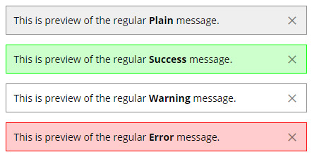
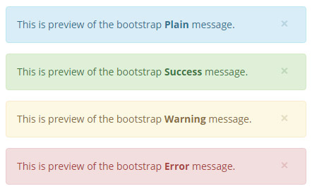

# The message helper #

``msg::get|set|put(); ``

Serves the user messages (optional session use). Can use [Bootstrap](http://getbootstrap.com/components/#alerts-dismissible) alerts dismissable styles.

### Session use ###
The [msg.php](msg.php) class ***set*** & ***get*** methods trigger session use, while the ***put*** method just prints a message to the output.  

### The helper methods###
* **Set** `msg::set("Site message come here!", "success")`. Stores the message in the session variable. The next method shows it on the next page load. Method is created to serve save/delete actions, where the action completion will trigger page reloading.
    
* **Get** `msg::get()`. Shows any stored in the session variable messages.

* **Put** `msg::put("Site message come here!", "plain")`. Shows a single message, without a session connection.

### Message types ###
* Regular messages:

	
 
* Bootstrap messages: 

	To activate the [Bootstrap](http://getbootstrap.com/components/#alerts-dismissible) alerts dismissable styles, just change the class constant `const USE_BOOTSTRAP = false;` value to `true`.

	